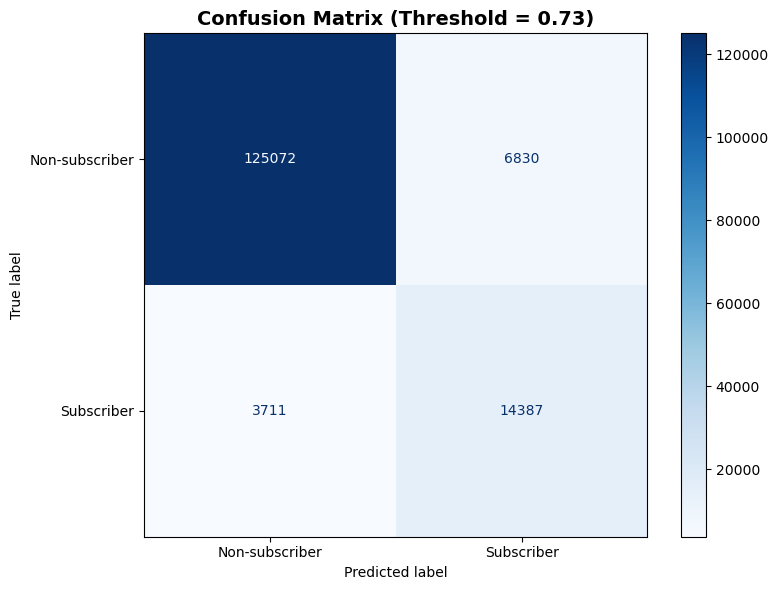
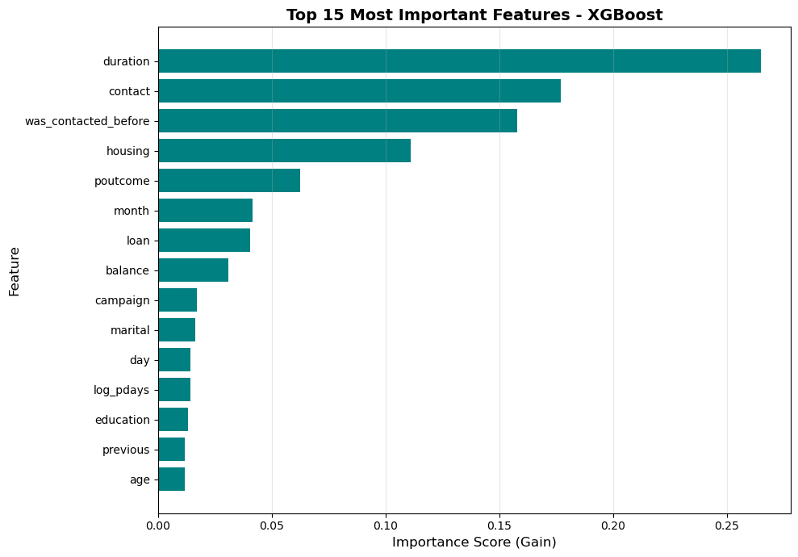

# Bank Marketing Campaign Prediction

Predicting customer subscription to bank term deposits using machine learning

##  Project Overview

This project analyzes bank marketing campaign data from a Kaggle competition to predict whether customers will subscribe to a term deposit. The analysis includes comprehensive exploratory data analysis, statistical testing, custom preprocessing pipelines for different model types, and comparative evaluation of multiple machine learning models.

**Competition Result**: Achieved **0.96 ROC-AUC score** on Kaggle's held-out test set using the optimized XGBoost model. 

## Dataset

- **Source**: [Kaggle - Bank Marketing Dataset](https://www.kaggle.com/competitions/playground-series-s5e8/overview)
- **Size**: [750,000 records 17 features]

##  Results

### Performance Summary

| Model | ROC-AUC | Precision | Recall | F1-Score |
|-------|---------|-----------|------|----------|
| Logistic Regression |0.9446| 0.60 | 0.70 |0.65 |
| XGBoost | **0.9665** | **0.68** | **0.79** | **0.73** |
| Neural Network | 0.9611 | 0.67 | 0.77 | 0.71 |


**Winner**: XGBoost demonstrated superior performance across all metrics, achieving a **0.96 ROC-AUC score** on Kaggle's held-out test set, demonstrating excellent generalization capability.

###  Model Diagnostics and Interpretability

####  Confusion Matrix (XGBoost)
This plot illustrates the model's ability to distinguish between positive and negative classes.


The model correctly identified most non-subscribers while maintaining solid performance on the subscriber class. At a 0.73 threshold, it achieves a strong balance between recall and precision, minimizing false positives and false negatives.

#### Feature Importances
These are the top 15 most influential features for predicting customer subscription.



Call duration emerged as the strongest predictor of term deposit subscription, with longer conversations strongly correlating with higher conversion rates. Communication type and previous contact history also play significant roles, while housing loan status and past campaign outcomes provide additional demographic and behavioral context. Together, the top three features, duration, contact type, and previous contact history all account for roughly 60% of the model’s predictive power, underscoring the importance of effective and targeted customer engagement.

##  Project Structure
```
bank-marketing-prediction/
│
├── data/
│   ├── raw/                          # Original datasets
│   │   ├── train.csv
│   │   └── test.csv
│   └── processed/                    # Preprocessed datasets
│       ├── X_train_nn.pkl            # For gradient based models
│       ├── X_test_nn.pkl            
│       ├── X_train_xgb.pkl           # For tree-based models
│       ├── X_test_xgb.pkl
|       ├── y_train.pkl
|       └── y_test.pkl
├── models/                           # Trained model artifacts
│   ├── logistic_regression.pkl
│   ├── xgboost_model.pkl
│   └── neural_network.pkl
│
├── transformers/                     # Fitted preprocessing transformers
│   ├── yeo_johnson_transformer.pkl
│   ├── scaler.pkl
│   ├── encoder.pkl
│   └── README.md                     # Documentation for transformers
│
├── notebooks/
│   ├── 01_exploratory_data_analysis.ipynb
│   ├── 02_data_preprocessing.ipynb
│   └── 03_model_training_evaluation.ipynb
│
├── submissions/                      # Competition submissions
│   ├── xgboost_predictions.csv
│   └── submission_log.md             # Track submission scores
│
├── plots/                            # Visualizations
│   ├── confusion_matrix.png
│   └── feature_importance.png
```
